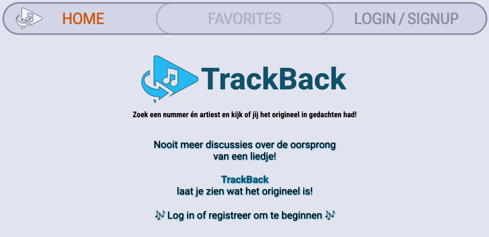
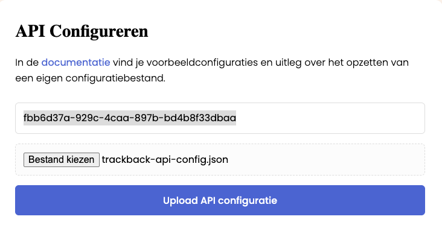

# TrackBack
Frontend application for exploring track versions and identifying original releases.<br><br>
🔗 GitHub Repository: https://github.com/MorschaVG/trackback
<p>
  <br>
  <em>Trackback pre-login homepage</em>
</p>

## Introduction

**Trackback** is a simple web application that lets a user search for a song by a specific artist and then tells
the user if that version is the original version.
It does this with the help of [MusicBrainz API](https://musicbrainz.org/doc/MusicBrainz_API)

- The user enters a song title and artist name and initiates a search. The application tells the user if this is
  the original version.
- If it's not, the application shows the user which artist made the original version.
- Finally, the user gets another option to see all other artists that also have a version of this
song, with an optional filter to exclude live versions and remixes.

## Requirements

- Node.js v18 or higher
- npm (comes bundled with Node.js)

This project was developed using:

- Node.js v22.19.0
- npm v11.8.0

You can check your versions with:

```
node -v
npm -v
```

Download Node.js here:
https://nodejs.org

## Setup
### 1. Install dependencies

```
npm install
```

### 2. Configure NOVI backend
The NOVI backend resets daily. Therefore, this configuration step must be repeated once a day before using the 
application.
- Navigate to: https://novi-backend-api-wgsgz.ondigitalocean.app/?projectId=fbb6d37a-929c-4caa-897b-bd4b8f33dbaa
- Upload the configuration file located in the root of this repository:
`trackback-api-config.json`
- There's a required project ID that should already be embedded in the URL above, but if manual input is still 
  required: <br>
`fbb6d37a-929c-4caa-897b-bd4b8f33dbaa`
- Click on 'Upload API configuratie'


### 3. Run the application

```
npm run dev
```

- Open http://localhost:5173/

## Environment configuration
This project uses environment variables via a .env file. In this case, the variables do not contain sensitive 
information so the .env is included.

## Test Accounts

The application and its backend have the ability to create new user accounts. But if you want get going immediately 
*(love the enthusiasm!)* here are two test accounts: <br><br>
**Test Account 1:**
``` 
admin@trackback.local
password: admin123
```
**Test Account 2:**
``` 
morscha@trackback.local
password: trackback123
```

Both of these accounts have 1 stored 'favorite' in the seed data inside the API configuration. This allows you to 
test a piece of functionality that allows the user to click on the favorite and re-run that search. 

## Test Cases

If you want to test the main functionality but don't know any songs (or can't google a list...) Here some options:

- *The man who sold the world* by **Nirvana** (original by: **David Bowie**)
- *I will always love you* by **Whitney Houston** (original by: **Dolly Parton**)
- *Hallelujah* by **Jeff Buckley** (original by: **Leonard Cohen**)
- *Respect* by **Aretha Franklin** (original by: **Otis Redding**)
- *All along the watchtower* by **Jimi Hendrix** (original by: **Bob Dylan**)

## Design 

**Figma Screen Designs:** https://www.figma.com/design/7UAbUWlFT1dmeoCFEfX9rl/Trackback?node-id=0-1&t=wWOtnOCUBHFbgKhc-1